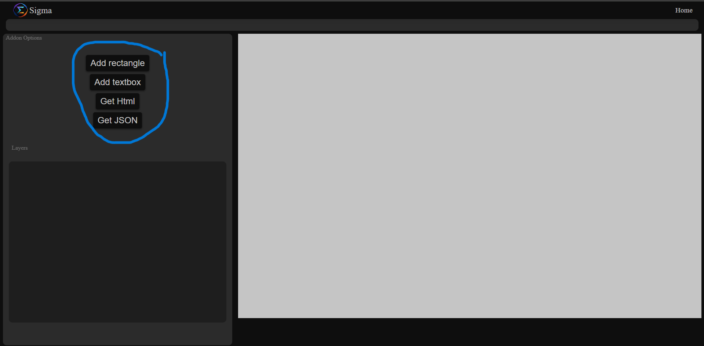
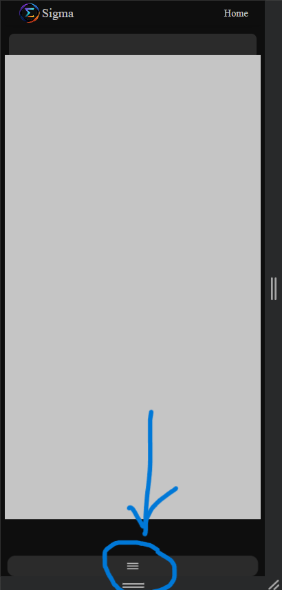
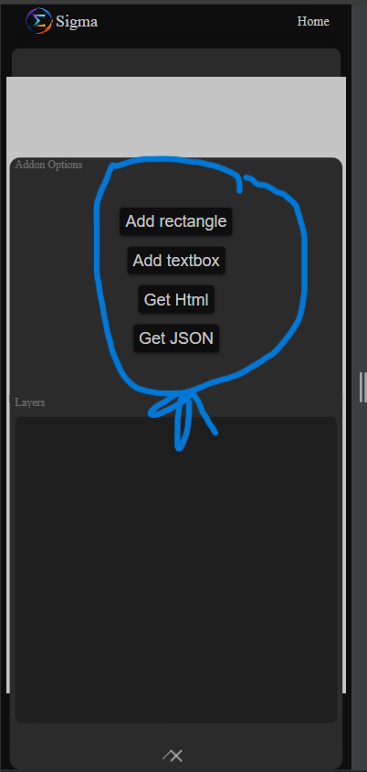
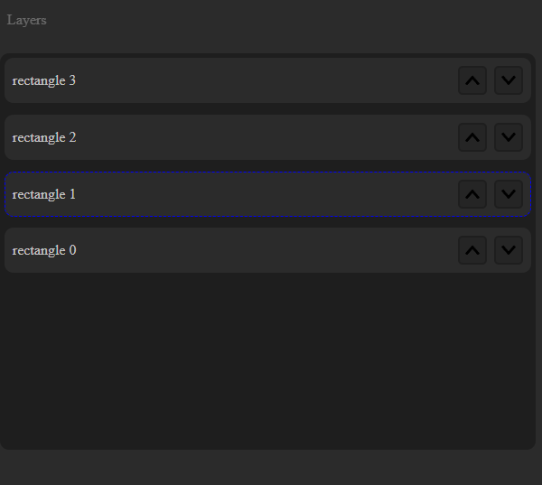
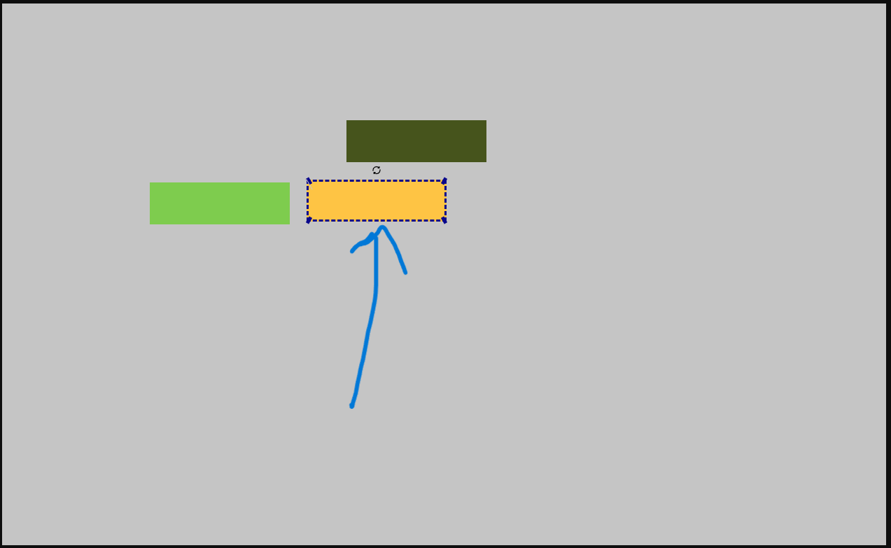
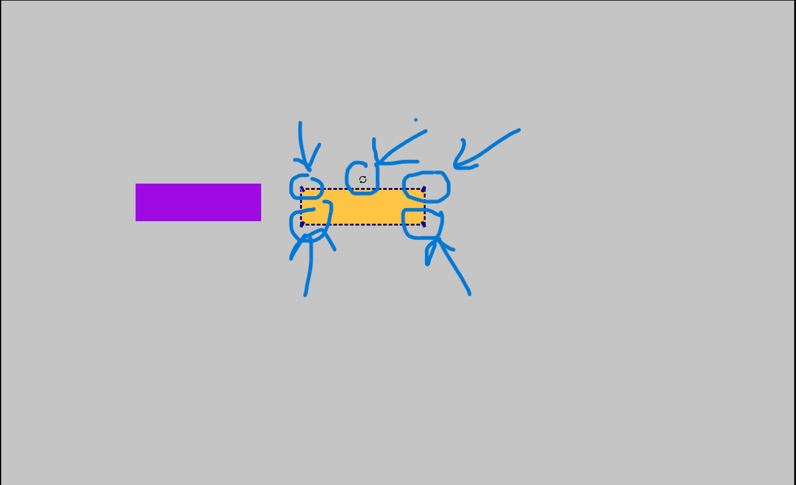
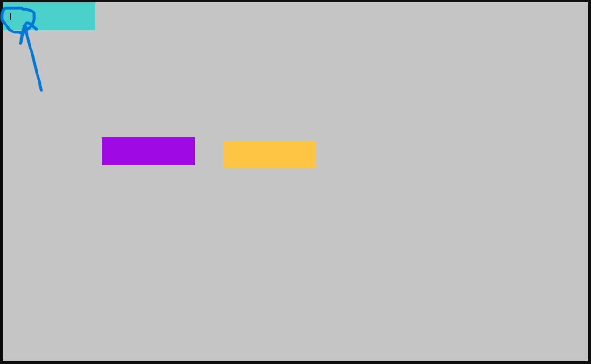
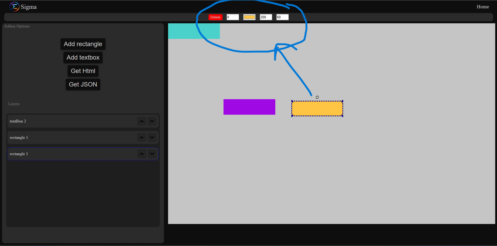

# Sigma 
### The sasta Figma

# Description:-
Hell everyone watching this repo myself `Bhavya Dhanwani`. The repo you see is of sigma which can be abrevatedd as the Sasta Figma. I had made this project for a competition named `InterBatch Showdown` powered by `Sheryians coding School`. Below is the full description of me.

# Usage:-
The website is genrally a image editor but without images as there is a canvas and we use it to edit and make images by adding Textbox or Rectangles and much more. The Website is fully Responsive and is made comaptible to both Mobile and PC or a laptop All the function works same on both the devices.

# Steps to use:-

### Sidebar:-
First lets have a look at the sidebar Here we can see the addon options from where we can `Add` `Rectangles` or `TextBoxes` or we can `Export` The canvas as a `JSON` file or `HTML` file.

In mobile the sidebar looks likes the below:-

Then Comes the Layers panel where you can move the elemnts up or down as needed. only if a item is selected.

### Canvas:- 

The white box you see is the canvas the All the divs we add appears in the canvas From there we can `Drag`, `Rotate` or `Resize` the selected div. The selcted div will be having a Blue dashed border like the below . Clicking a div selects it.

if you notice the `corners` of the selected image there are small bozes which are generally the `resize handles` you can hold them and resize the Textbox or a Rectangle with that you will see a circle type shape which is generally `rotate hadle` By grabbing it you can rotate the Textbox or Rectangle. In the below image you can see the handles.

On adding a `Textbox` your cursor wil directly focus to a input where you can type your text. And if you are in Pc Then Double clicking the element allows you to edit the text and in Mobile keep the div pressed for 0.7s to edit it. You can seee how it will focus when it's added.
<!--  -->

### Edit:-

To edit a element First it needs to be selected by clicking it because as you click on it there will be edit options which will appear above the canvas as you can see in the image.

The first one is delete clicking it `deletes` the element and then is the `border radius` which gives a curve to the element then is the `Bg color` which changes the Backround colour of a Div then is `width` and `Height`
all the values changes as you edit it will take 0.5 sec to load as Debouncing is used. to allow to type.

# Approach:-

The approach is simple I had used `classes` everyWhere to create and edit elements as one function in a `classes` can be reused in a same way everywhere for every element whichout any issue. So every Element is a claas.

Then i had used mouse tracking and cordinate calculation for `Drag` Like for drag the approach is like First I took the mouse positon from where `Drag starts` then tracked the mouse positon when it was moving by that i calculate difference between the original annd the new position of mouse by that if i get `x = Horizintal distance ( "+" if left move, "-" if right move )` `y = Horizintal distance ( "+" if up move, "-" if down move )`

Then same as `resize` by cordinates calculation  i get the distance mouse moves and by that i resize.

For resizing from `topLeft` i move the div at `x` and `y` also as so that the bottom part remains as it is which feels like real resize. From `topRight` moved the div at `y` only and at `bottomLeft` i moved it at `x` only and in `bottomRigh` no move. Width and goes on increase or decrease in all.

For `rotate` i Used `atan2` which i found on `Stackoverflow`.

The edit pane value changes on type or something but it takes 0.5sec to update as debounce is used so that `Irritation`is not created as min height and width is 40px so if you try to type 300 you reomve whats written ans it imidiately give 40so to prevent it i used `Debouncing`.

# Use of ai:-

The  `AI` Like the `Chat Gpt` is used for logo generation and the `Ai` like `Gemini's  Veo 3.1` is used for video geenration for homepage. else for concepts `Stack overflow and lectures of cohort 2.0` are widely used as Ai was not allowed for the same.

Please `Star` the Repo if you like the project and Check it out at below link

[Click here to see the Website](https://sigma-chi-liart.vercel.app/)